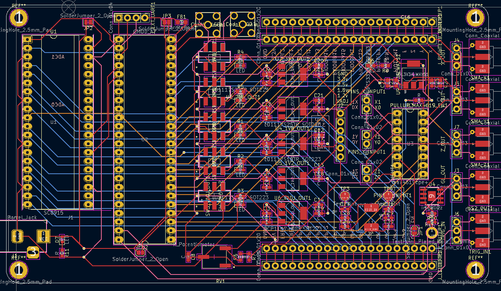

# glitcher



## Introduction

Glitcher is a homebrew fault injection system, built around a Pi Pico and CMOD A7, with a MAX4619 and an irf7807 providing multiplexer and crowbar mosfet style glitching respectively. Generous GPIO (FPGA + Pi Pico) + SMA outputs are available.

This project is heavily inspired by the ChipWhisperer set of products.

## Use

The Pi Pico is the simplest method of using this. Using a micro USB cable, access the MicroPython interface and use the glitcher library to control the FPGA's default firmware:

```
import glitcher

g = glitcher.Glitcher()
g.enablemux(True)      # enable max4619. crowbar always "on"
g.setmux(0xF)          # all 3 channels
g.rnr(delay=5,width=5) # write delay/width, glitch 

```

The Pi Pico uses only a serial port to talk to the FPGA at 9600bps, so you can swap it for some other uC / make a shield / whatever.
